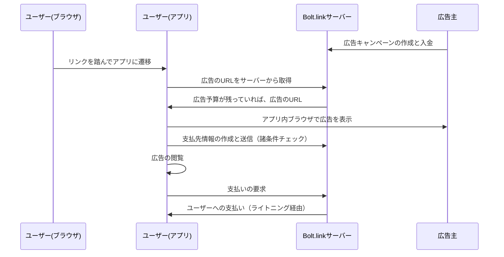

# Bolt.link（仮称） — 広告を見てSatsを貰おう

# 概要

ビットコインのライトニングネットワークを初めて使う上でのハードルの1つは少額のビットコイン（Sats）を手に入れることです。
Bolt.linkはDiamond Walletユーザーに広告を見て少額のSatsを支払うことで、カストディ型のウォレットに頼ることなくこの問題を解決します。

Satsを受け取るには、ユーザーは：

- Diamond Wallet内にすでに入金してチャネルを開設している（費用 3,000 sats）か、チャネルの開設費用を広告主に負担してもらえる特別なコード付きのリンクを持っている必要があります。（チャネルが新規に開設されます）
- そのうえで、特別なリンクにアクセスすることでウォレットアプリが立ち上がり、アプリ内ブラウザで広告先のURLが開きます。ユーザーが広告を閲覧する間に、バックグラウンドでウォレットがインボイスを作成し、自動的に支払いを要求します。

広告主はこの仕組みを活用して少額のSatsを支払うことでライトニングユーザーを自社ウェブサイト等に誘導することができます。

# Bolt.linkのメリット

## 広告主にとってのメリット：

直接ライトニングネットワークのユーザーに広告を見てもらえる。

## ユーザーにとってのメリット：

ノンカストディアルなウォレット（Diamond Wallet）に直接少額のSatsを貰うことができある。

## Bolt.linkの現状

Bolt.linkはまだコンセプト実証・テスト段階にあり、外部の広告主からの広告は募集していません
ユーザーはDiamond Walletアプリをインストールして入金することで使うことができます。
Satsがもらえるリンクの大半はDiamond Handsテレグラム内にて配布されています。
広告がユーザーのデバイスに自動的に通知・配信されてくる仕組みではありません。

# 仕組み

Diamond WalletはGreenlightとBreez SDKを使ってクラウド上にユーザー固有のライトニングノードを割り当てつつ、秘密鍵はユーザーのスマホ上にしか存在しないノンカストディアルウォレットです。

ユーザーが「https://ads.diamondhands.technology/c/example」のような特別なリンクをクリックすると、Diamond Walletアプリが立ち上がり、下記のプロセスで広告の配信と報酬の支払いが開始されます。
（アプリがインストールされていない場合は、インストール方法への誘導とQRコードがある画面が表示されます。）

リンクにアクセスすると、広告キャンペーンに資金が残っている場合はウォレットが実際の広告URLを取得し、アプリ内ブラウザでユーザーに表示します。
この時点で、ウォレットは支払先情報となるBOLT11インボイスを広告の指定した金額で生成しサーバーに送信します。
サーバーはこのインボイスを元にライトニングチャネルの保有を確認するなどして、ユーザーが利用条件に合致するか検証します。

ユーザーが広告を閲覧すると、ウォレットは先程のインボイスに対する支払いをサーバーに要求し、サーバーはライトニングネットワーク経由で送金を行います。
このように、ユーザーは広告閲覧の対価として少額のSatsを受け取ることができます。

多重請求する不正への対策は、開設にコストのかかるライトニングチャネルを必須にすることで実施しています。
また、現状では更にそのチャネルが特定のノード（LSP）とのものであること、実際の支払いもそのチャネルを経由することを追加の条件として課しているため、利用可能なユーザーはDiamond Walletユーザーに限定されています。

なお、「ワンタイムコード」を利用する広告キャンペーンを作成した場合は、まだチャネルがないユーザー（例えば新規のDiamond Walletユーザー）にも、事前にチャネルを開設することなく利用していただけます。
チャネル開設に必要な3,000 satsも必要なくなるため、新規ユーザーのオンボーディングに役立ちます。

# 将来の展望

以下のものを含め、新機能の追加などを検討しています：

- ユーザーへの広告のプッシュ
- アフィリエイト機能

# 先行事例

テレグラムbotの「Lntxbot」にあった「sats4ads」機能は広告閲覧の対価としてユーザーにSatsを支払う先行事例です。ただし、sats4adsではユーザーが個別に文字単価を設定できるマーケットプレイス形式であったり、
広告がプッシュ型であったり、Lntxbotがカストディ型のウォレットであった点などはBolt.linkと異なります。

Fountain.fmなど一部のポッドキャストアプリは、視聴することでユーザーがSatsを得られたりします。
また、一部のゲームアプリはユーザーが特定の条件を達成するとSatsを得られます。
このようにユーザーにSatsを付与することでアプリのアクティビティや売上が改善できるというデータがあります。
