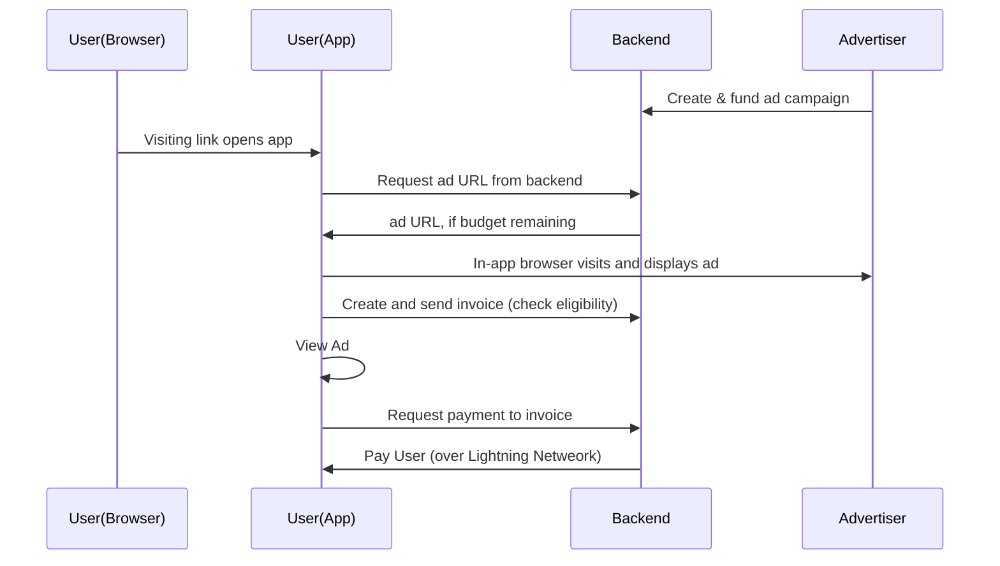

# Bolt.link — View ads to earn sats

# Abstract

One of the first challenges a new Lightning user faces is where to get their first sats. Bolt.link allows users to receive payments in exchange for viewing ads in Diamond Wallet, eliminating this challenge while users can maintain custody of their funds.

In order to receive sats, a user must:

- Already have their own channel in Diamond Wallet (costs 3000 sats), OR have a special link with a one-time-code that allows users without a pre-existing channel to claim sats. (A new channel is opened and the channel open fee is deducted when receiving these sats.)
- Visit a special link, which prompts the wallet to open an advertisement in the in-app browser. The wallet will create and invoice and request a payment in the background as the user views the advertisement.

This enables advertisers to pay users a small amount of satoshis for viewing their website, etc.

# What Bolt.link does

## For advertisers:

Advertise directly to Lightning Network users.

## For users:

Earn sats directly to a non-custodial wallet (Diamond Wallet).

## Current Status

[Bolt.link](http://Bolt.link) is still in its proof of concept / testing stage, and is not yet open to outside advertisers. Users may sign up by downloading the Diamond Wallet app & funding a channel. Most links are published in the Diamond Hands Telegram channel. Advertisements are not directly pushed to the user / app.

# How it works

Diamond Wallet is a non-custodial wallet that uses Greenlight and the Breez SDK to host each user’s own Lightning node in the cloud, while the keys stay on the user’s device.

When a user clicks on a special link (e.g. [https://ads.diamondhands.technology/c/example](https://ads.diamondhands.technology/c/example)), if they have Diamond Wallet installed on their Android or iOS device, the app will start the process outlined below. (If the app is not installed on the device, a page with installation instructions and a QR code link will be displayed.)

Upon clicking the link, the wallet will request the actual URL of the advertisement if there is money left in the advertisement campaign, and display it in the in-app browser. At this point, the wallet will send the server a BOLT11 invoice with the amount specified by the ad campaign, which also allows the server to validate the user’s node public key (nodeID) and that they have a Lightning channel.

Once the user views the advertisement, the wallet will then request payment to the invoice, which the server will promptly pay. Thus, the user was paid some sats to view an advertisement in the wallet’s in-app browser.

Fraud is disincentivized by requiring a Lightning channel, which incurs an initial cost on each user. Currently, we also require that the payment be sent through a special LSP, which limits this function to users of Diamond Wallet (no other wallets are supported).

There is also a setting for campaigns that enables “one-time codes” to be used for extra authentication when requesting the ad campaign. This allows ad campaign operators to hand out individualized one-time-use links to e.g. conference attendees, allowing users who don’t already have a Lightning channel in Diamond Wallet (costs 3000 sats) to be paid without inviting fraud.

# Considerations for the future

Potential features we are looking into include:

- Pushing advertisements to users directly
- A referral scheme

This list is not exhaustive.

# Priors

The “sats4ads” function in the Telegram bot “Lntxbot” used to serve a similar purpose, where users would set a price per character at which they would be willing to be paid to receive ads. The difference is that Lntxbot was a custodial wallet, that the users were able to set their own prices (it was a marketplace of ads and viewers, so to speak), and that advertisements were directly pushed to users (in Bolt.link, the user must visit a link to receive the advertisement).

Some Podcasting apps, such as Fountain.fm, allow users to get paid for listening to podcasts. Some games grant players sats for completing certain milestones. Rewarding sats to users in this way can boost activity and revenue for apps.
